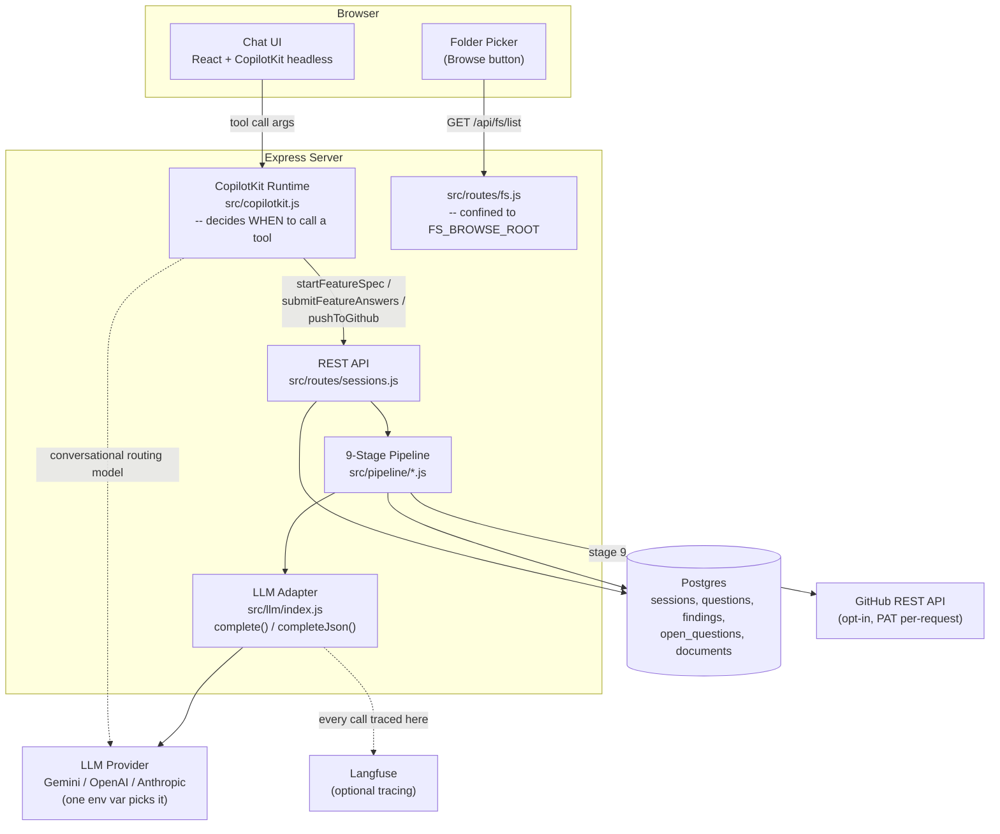
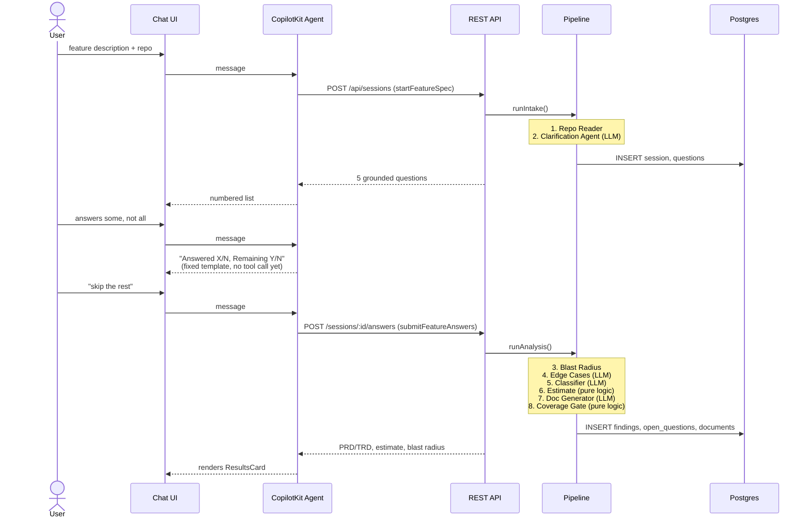
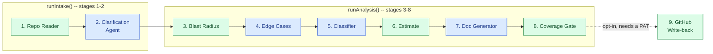
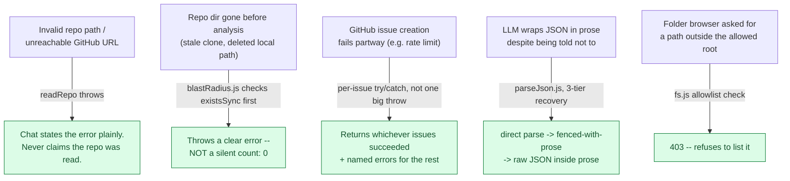

# Architecture

Reference diagrams for Spec Clarity's system design, data flow, and failure
handling. See `README.md` for setup/usage and the full eval writeup.

## 1. System components

Two layers, kept deliberately decoupled: the chat orchestration (CopilotKit,
decides *when* to call a REST action) and the pipeline (plain REST API, has
no idea a chat exists).

## 2. Request flow — one full session

Two REST round-trips, matching the two halves of the pipeline: intake
(before answers exist) and analysis (after).

## 3. Pipeline stages

Blue = LLM call. Green = pure deterministic code (no model, unit-tested).

## 4. Failure modes

What breaks, and what the system does about it today.

**Known, not fixed — documented in `README.md`, not hidden:**
- Blast radius tallies by filename only: this repo has three unrelated
  `index.js` files that collide under one key and all report the same wrong
  count. Real fix is a proper dependency graph (madge/dependency-cruiser).
- The GitHub PAT is collected through chat, so it transits whichever LLM
  provider is configured before reaching this backend. Fixing it needs a
  separate, out-of-band input path — not built.
- No rate-limiting anywhere in the API yet.
